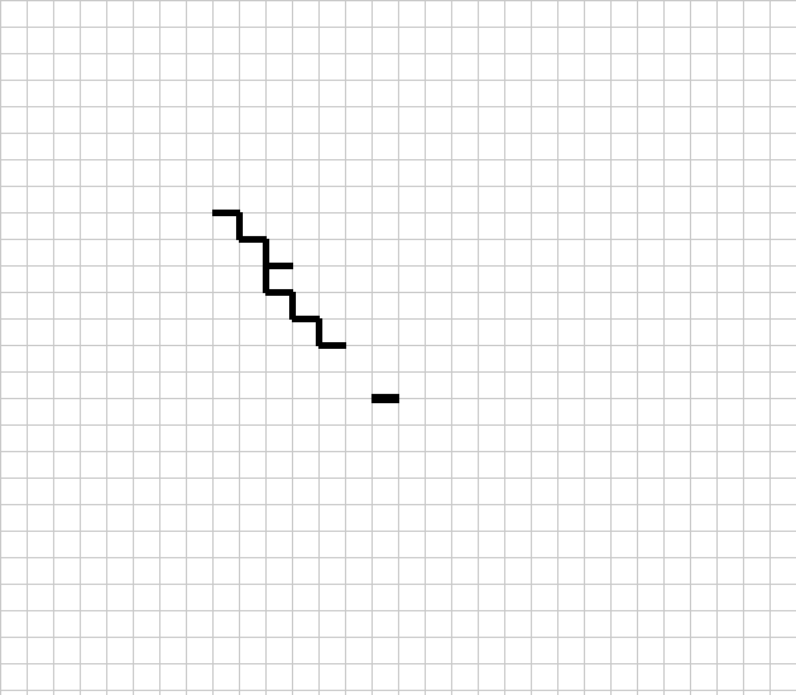
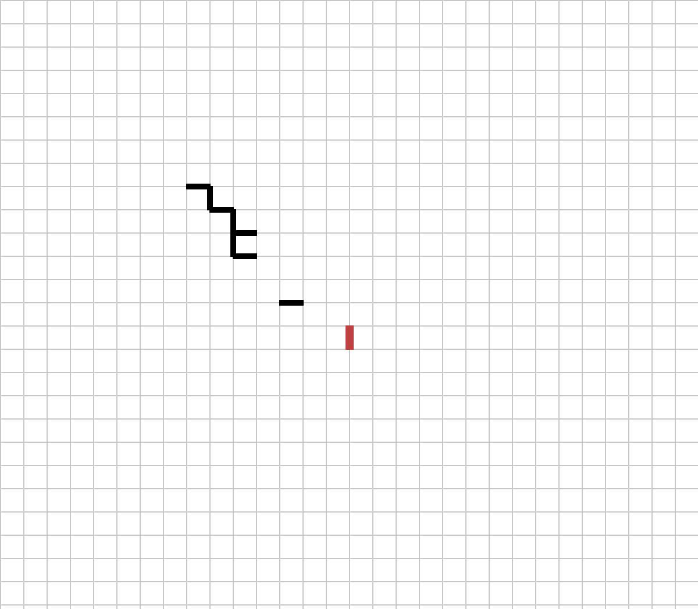
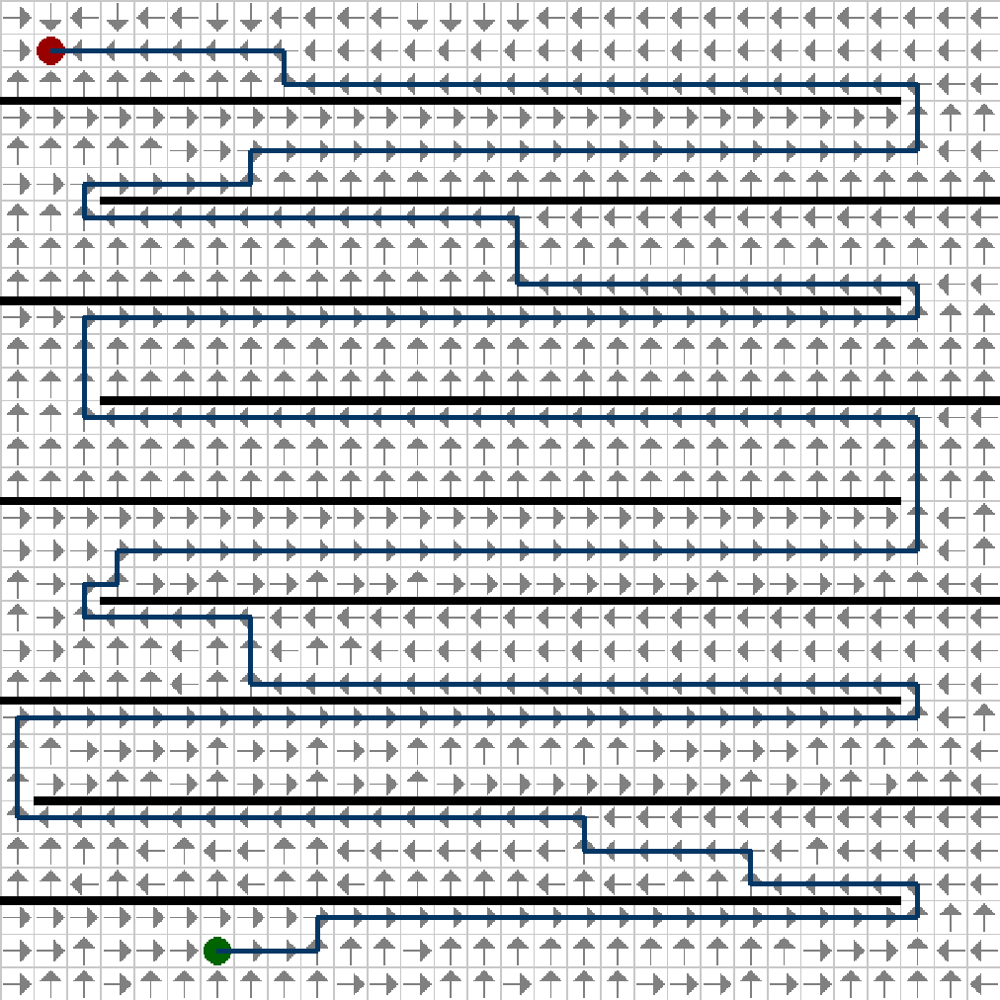

# Dijkstra Visualization

This is a visualization of [Dijkstra's algorithm](https://en.wikipedia.org/wiki/Dijkstra%27s_algorithm).

## Installation

```{bash}
$ make build
$ make
```

## How to use it

* `Mouse wheel`: Change current action
* `Left click`: Execute current action
* `Enter`: Compute dijkstra's algorithm
* `C`: Clear dijkstra's algorithm results


## Pictures

### Add walls (equivalent to delete an edge in the graph)



### Delete walls (equivalent to add an edge in the graph)



### Path


